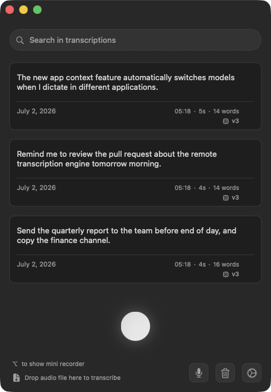
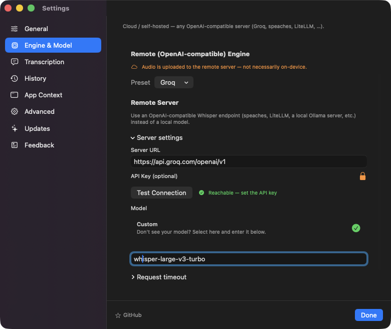
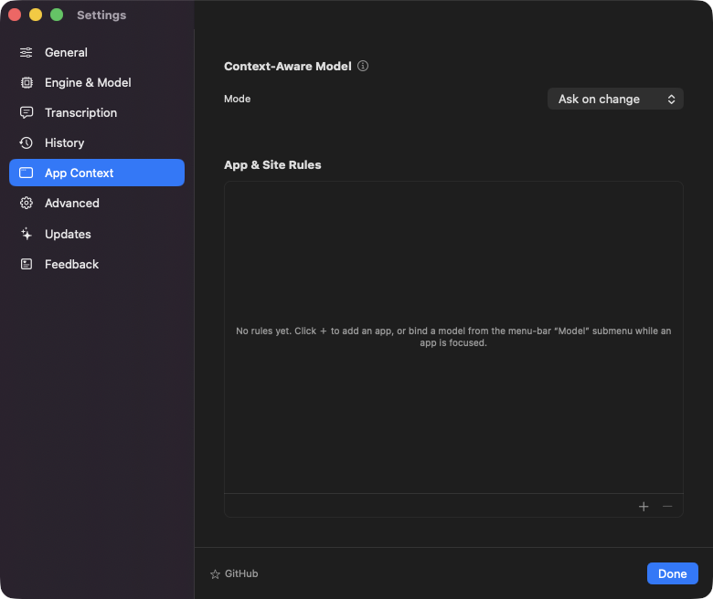

<div align="center">

# OpenSuperWhisper

**Speak. It types. In any app on your Mac — free, open-source, on-device.**

[](https://opensuperwhisper.com)
[](https://github.com/my-monkeys/OpenSuperWhisper/releases)
[](LICENSE)

Hold a shortcut, speak, release — your words land in whatever app you're in.
Four transcription engines (three fully on-device), no subscription, no account, no telemetry.



</div>

> **Community fork maintained by [My-Monkey](https://my-monkey.fr)** — a maintained successor to
> [`Starmel/OpenSuperWhisper`](https://github.com/Starmel/OpenSuperWhisper) (MIT). Merged work
> credits its original authors. Compare the engines on real benchmarks at
> [opensuperwhisper.com](https://opensuperwhisper.com).

## Install

```sh
brew install --cask my-monkeys/tap/opensuperwhisper
```

> ⚠️ Use the full `my-monkeys/tap/` path — the bare name `opensuperwhisper` resolves to the
> original (unmaintained) cask in homebrew-cask, not this fork.

Or download the latest **notarized** `.dmg` from [Releases](https://github.com/my-monkeys/OpenSuperWhisper/releases),
or [build from source](#building-from-source).

**Requires** macOS 14 (Sonoma) or later, Apple Silicon or Intel — Homebrew picks the right build
automatically. (The Intel build ships Whisper + Parakeet; SenseVoice is Apple-Silicon-only.)

## The basics

- ⌨️ **Global shortcut** — a key combination or a single modifier key (Right ⌥, Left ⌘, Fn…), with
  hold-to-record: hold to speak, release to insert.
- 👀 **Live preview** — watch the text build up in the recording indicator as you speak (Parakeet).
- 📍 **Indicator where you want it** — near the cursor, at a screen edge, or docked in the
  **notch / Dynamic Island** (real or faux). Optional on-bubble **Stop / Cancel buttons**
  (off by default — Settings → General → Recording Behavior).
- 📁 **Files too** — drag audio files onto the app (or `opensuperwhisper transcribe file.m4a`
  from the terminal) and they queue up.
- 🌍 **Speaks your language** — ~99 languages with auto-detect (incl. Hebrew via an
  [ivrit.ai](https://www.ivrit.ai/) model), live **translation to English**, and an interface
  localized in English, French, German, Spanish, Italian, Portuguese (BR) and Vietnamese.

## Four engines, your choice

| Engine | Runs | Best for |
|---|---|---|
| **Whisper** ([whisper.cpp](https://github.com/ggerganov/whisper.cpp)) | On-device | Accuracy, ~99 languages, translation to English |
| **Parakeet** ([FluidAudio](https://github.com/AntinomyCollective/FluidAudio)) | On-device | Speed + live preview, 25 European languages |
| **SenseVoice** ([sherpa-onnx](https://github.com/k2-fsa/sherpa-onnx)) | On-device | Chinese, Cantonese, English, Japanese, Korean |
| **Remote** | Your server | Any OpenAI-compatible endpoint — Groq preset, LiteLLM, [speaches](https://github.com/speaches-ai/speaches), a box on your LAN |

<div align="center">

</div>

The **Remote** engine sends audio to *your* chosen server (and says so, plainly). It lists the
server's models after an authenticated **Test Connection**, retries transient network hiccups, and —
if your server is unreachable — can **fall back to a local model** so dictation never just fails.
Models load lazily: browsing engine tabs never triggers a surprise download.

## Smart while you dictate

- 🪟 **App Context** — bind a model to an app (or a website in supported browsers) and the model
  switches automatically when you dictate there: a fast one for chat, an accurate one for email.
  Managed from Settings → App Context or the menu-bar **Model** picker.
- 📖 **Custom dictionary** — your proper nouns and jargon come out spelled right; boosts
  recognition and applies replacements.
- 🧹 **Cleaner output** — optional filler-word removal (um, uh…), automatic sentence spacing, and
  "No speech detected" is never pasted.
- 🤖 **AI cleanup** — optionally tidy punctuation/casing through a local [Ollama](https://ollama.com)
  model. Fully on-device, opt-in.
- ⏯️ **Media handling** — pause other apps' playback (and resume only what was actually playing) or
  duck the system volume while you record.
- 🎤 **Any microphone** — built-in, external, Bluetooth or iPhone (Continuity), switchable from the
  menu bar.

<div align="center">

</div>

## A history that remembers (if you want one)

Every dictation records **where** it happened (app, window title, site) and **which model**
transcribed it. Rerun any entry with a different model from the ↻ menu; failed transcriptions
keep their audio with a retry button instead of vanishing. Or turn history off entirely —
nothing is persisted, and retention limits (count / age) are available in between.

## Private by default

On-device engines never send audio anywhere. There's no account, no telemetry, and the only
network path is the Remote engine — which you explicitly configure and which labels itself
clearly. History is yours to disable or cap.

## Command line

```sh
opensuperwhisper transcribe path/to/audio.wav          # text on stdout
opensuperwhisper transcribe path/to/audio.wav --json   # { "file", "text" }
```

Engine logs go to stderr, so it pipes cleanly: `opensuperwhisper transcribe note.m4a > note.txt`.
Set up a model in the app at least once first. There's also a **post-record hook** to run your own
shell command after each dictation (text + audio path via env vars / JSON on stdin).

## 🧪 Beta testing — we need you

Real-world testing is what makes this stable. Pre-release builds are on the
[Releases page](https://github.com/my-monkeys/OpenSuperWhisper/releases) (marked *Pre-release*) —
they install alongside stable and never touch your auto-updates.

- 🐞 **Bugs** → [open an issue](https://github.com/my-monkeys/OpenSuperWhisper/issues/new) with your
  macOS version, the engine/model in use, and steps to reproduce.
- 💬 **Feedback** (no account needed) → the form on [opensuperwhisper.com](https://opensuperwhisper.com/#feedback).

## Support the project

OpenSuperWhisper is free forever — no Pro tier, no paywall. If it saves you time, you can
[**buy the monkeys a banana on Ko-fi**](https://ko-fi.com/mymonkey): donations keep the nonprofit
(association loi 1901) running and the open-source work alive. 🍌

## Building from source

<details>
<summary>Clone, install the toolchain, build</summary>

```sh
git clone git@github.com:my-monkeys/OpenSuperWhisper.git
cd OpenSuperWhisper
git submodule update --init --recursive
brew install cmake libomp rust ruby
gem install xcpretty
./run.sh build
```

If something breaks, `.github/workflows/build.yml` is the CI recipe that builds the app on every
push. Maintainers: see [`docs/PUBLISHING.md`](docs/PUBLISHING.md) for the notarized-release +
Homebrew flow.

</details>

## Contributing

Contributions are welcome — issues, focused PRs, or big ideas
([the last community batch](https://github.com/my-monkeys/OpenSuperWhisper/pull/21) shipped a whole
menu of features). Open items live in the
[issue tracker](https://github.com/my-monkeys/OpenSuperWhisper/issues).

## License

MIT — see [LICENSE](LICENSE). Built on [whisper.cpp](https://github.com/ggerganov/whisper.cpp),
[FluidAudio](https://github.com/AntinomyCollective/FluidAudio),
[sherpa-onnx](https://github.com/k2-fsa/sherpa-onnx) /
[SenseVoice](https://github.com/FunAudioLLM/SenseVoice),
[autocorrect](https://github.com/huacnlee/autocorrect) and
[Sparkle](https://sparkle-project.org). 🐒
